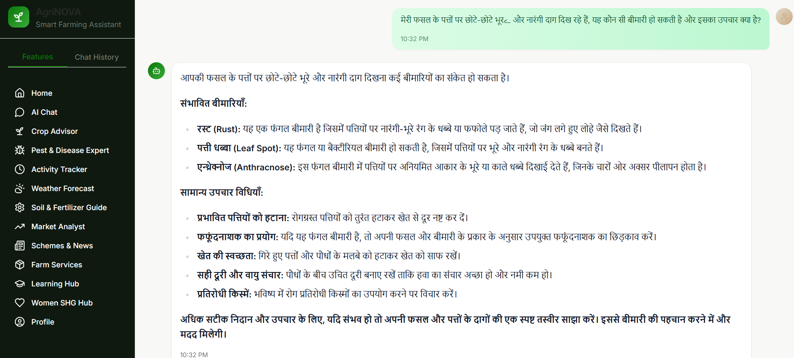

# AgriNOVA Frontend – AI-Powered Personal Farming Assistant  

AgriNOVA is an AI-powered Personal Farming Assistant.  
It acts as a “Krishi Sakhi” (Digital Friend) for farmers, delivering personalised, proactive, and contextual agricultural guidance throughout the crop cycle.  

This repository contains the frontend application, providing a simple, multilingual, and farmer-friendly interface to interact with backend AI services.  

---

## Core Features  

### Farmer & Farm Profiling  
Capture key details like land size, location, soil type, crop, and irrigation method.  

### Conversational Interface  
Voice and text interaction in Malayalam, Hindi, and other Indian languages.  

### Activity Tracking  
Farmers log sowing, irrigation, pest sightings, or fertilizer usage in simple terms.  

### Personalised Advisory  
AI generates proactive, contextual alerts and tips, e.g.:  
- "Rain expected, avoid spraying tomorrow."  
- "Pest outbreak nearby—inspect your brinjal crop."  

### Personalized Alerts & Notifications  
Farmers receive reminders and push notifications for:  
- Crop operations (irrigation, fertiliser, harvest)  
- Government scheme deadlines  
- Weather warnings (rainfall, heatwaves, storms)  
- Market price fluctuations and trends  

### Knowledge Engine  
Uses local crop calendars, pest data, government advisories, and best practices for improved recommendations.  

---

## Expected Impact  
- *Empowerment:* Farmers get personalised, on-demand support anytime.  
- *Sustainability:* Timely actions improve productivity and resource efficiency.  
- *Bridging Gaps:* Combines AI intelligence with local knowledge to close the advisory gap.  
- *Timely Action:* Personalized alerts and notifications reduce crop losses.  
- *Accessibility:* Makes advanced agronomic insights available in simple, local language formats.  

---

## System Architecture  

The system integrates multiple modules into a seamless farmer experience:  

*Flow Overview:*  
- Farmers interact via text, audio, or image inputs.  
- Inputs are processed by the RAG Pipeline (retrieval + agentic AI + LLM).  
- Specialized modules handle crop recommendations, pest detection, weather alerts, market data, and government schemes.  
- Farmers receive outputs in their local language with confidence scores, visuals, personalized alerts, and reminders.  
- Feedback loops ensure continuous learning and refinement.  

---

## Tech Stack  

- *Frontend Framework:* React + Vite + TypeScript  
- *Styling:* Tailwind CSS  
- *Charts & Visualization:* Recharts / Chart.js  
- *State Management:* React Context API  
- *APIs Integrated:*  
  - Weather & Disaster Alerts
  - Pest/Disease Detection
  - Crop and Fertiliser Recommenders  
  - Government Schemes API
  - Learning Hub/SHG 
  - Market Price/Analyst API  
- *Backend AI:* RAG Pipeline, ML Models, CNN Models, Agentic AI System  

---

## Screenshots  
- Chat Interface
   
- Pest Detection Advisory  

---

## Repository Structure  

```Agri_Frontend/
├── public/
├── src/
│ ├── components/ 
│ ├── pages/
│ ├── hooks/ 
│ ├── utils/ 
│ ├── styles/ 
│ └── App.tsx
├── package.json
└── README.md
```


---

## Getting Started  

1. *Clone the Repository*  
```bash
git clone https://github.com/arkumar249/Agri_Frontend.git
cd Agri_Frontend
Install Dependencies

bash
Copy code
npm install
Setup Environment
Create a .env file:

ini
Copy code
VITE_API_BASE_URL=https://backend-api-url.com
Run Development Server

bash
Copy code
npm run dev
Open: http://localhost:8080
```

🔗 Related Repositories

[AGRI_BACKEND](https://github.com/arkumar249/AGRI_BACKEND.git) – Backend APIs & ML models


AgriNOVA is more than just software — it is a digital friend (Krishi Sakhi) walking with farmers through every stage of cultivation, helping them make informed, confident, and sustainable decisions.

